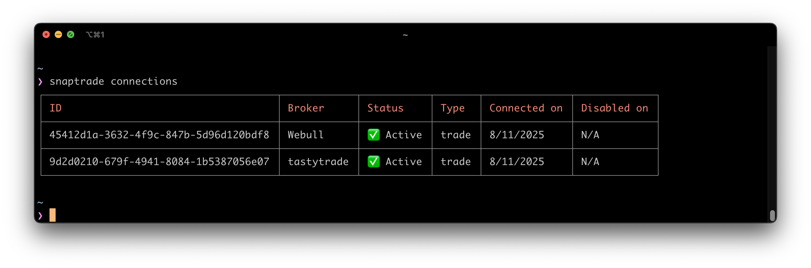
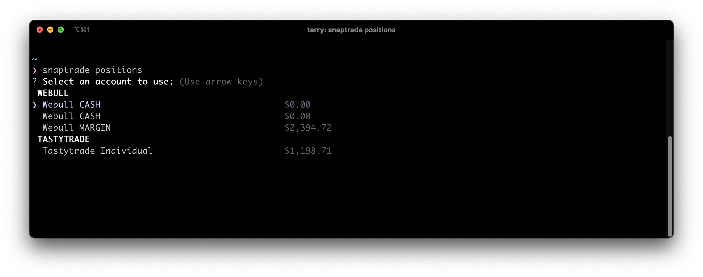
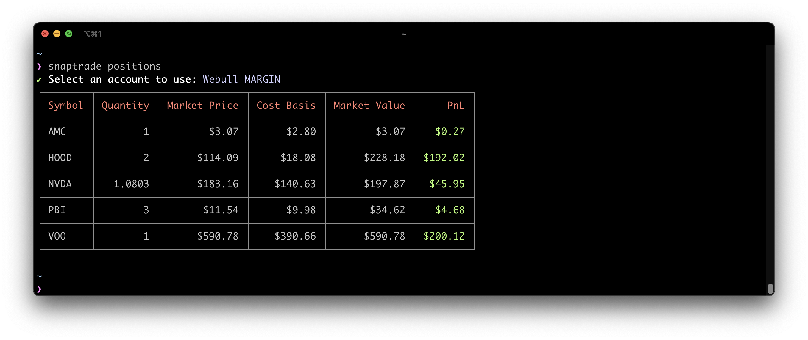
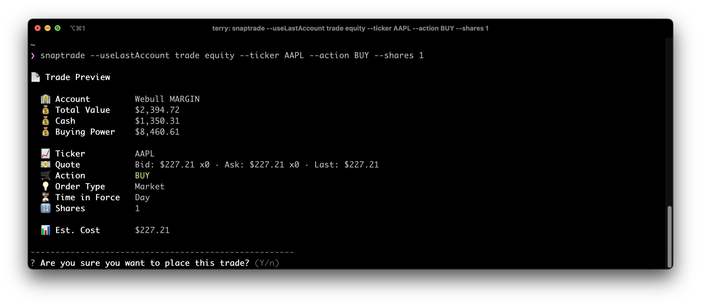

# SnapTrade CLI

`snaptrade` is the quickest way to get started with the [SnapTrade](https://snaptrade.com/) API. Link your own brokerage accounts, manage your portfolios, and execute live trades all from the command line!

## 🚀 Quick Start

Install the CLI globally using npm:

```bash
npm install -g @snaptrade/snaptrade-cli
```

Then run the CLI:

```bash
snaptrade
```

When you run `snaptrade` for the first time, you need to provide your SnapTrade client ID and consumer key


---

Once the credentials are set, call `snaptrade connect` to connect a new account. This will register a new SnapTrade user and open the Connection Portal in your default browser. Pick a broker of your choice to finish the connection process. If you don't have/want to use a live account, you can register an Alpaca paper account with just an email and choose Alpaca Paper in the Connection Portal.

> [!NOTE]
> A free key only has access to a limited set of brokers and cannot execute live trades at the moment.


---

To see which brokers are supported along with whether trading is enabled, you can run `snaptrade brokers`.

> [!NOTE]
> To see the latest broker support and capabilities, please refer to this [Notion page](https://snaptrade.notion.site/brokerages).


You can also specify the broker directly with `snaptrade connect --broker <broker slug>` to skip the broker selection step of the Connection Portal.


---

Once connected, call `snaptrade connections` to list all current connections.



and `snaptrade accounts` to list all connected accounts.


---

Use `snaptrade positions` to list all positions for an account. You'll be prompted to select an account first.



or `snaptrade positions --all` to list all positions across all accounts.


---

To submit an equity order, use `snaptrade trade equity`. It'll prompt you for confirmation before continuing.

You can pass `--useLastAccount` to skip the account selector and use the previously selected account instead.

> [!NOTE]
> A free key does not have access to trading at the moment. Please reach out to sales@snaptrade.com to discuss your trading usecase.



---

To submit a multi-leg option order, use `snaptrade trade option`. It'll prompt you for confirmation before continuing.


---

Once the order is submitted successfully, you have the option to cancel it if it hasn't been filled by the broker. You can find the broker order ID in the response:


To submit a cancellation request, use `snaptrade cancel-order`. It'll prompt you for confirmation before continuing.


---

To see a list of all your recent orders, including the one you just placed, use `snaptrade orders`.


---

This concludes the quick start guide. Check out our [documentation](https://docs.snaptrade.com) for more information.

## 📚 Commands

```
Usage: snaptrade [options] [command]

CLI tool to interact with SnapTrade API

Options:
  -V, --version              output the version number
  --useLastAccount           Use the last selected account for account specific commands (default: false)
  --verbose                  Enable verbose output (default: false)
  -h, --help                 display help for command

Commands:
  status                     Get current status of your SnapTrade API credentials
  brokers                    List all brokers available to connect
  connect [options]          Establish a new broker connection
  reconnect [connectionId]   Re-establish an existing disabled connection
  disconnect [connectionId]  Remove an existing broker connection
  connections                List all broker connections
  accounts                   List all connected accounts
  positions [options]        List all positions for a given account
  recent-orders              List the most recent orders (within last 24 hours) for a given account
  orders                     List all orders for a given account
  instruments                Get a list of available instruments from a broker
  quote [symbols]            Get the latest market quote
  trade [options]            Execute different types of trades (equity, options, crypto)
  cancel-order [options]     Cancel an existing order
  profiles                   Manage SnapTrade CLI profiles
  help [command]             display help for command
```

## ☕️ Development

You need the following before getting started:

- [mise](https://mise.jdx.dev/) - manages the project specific node version

To run the cli locally:

```
npm install
npm link
snaptrade
```

To release a new version, run `npm run release`
